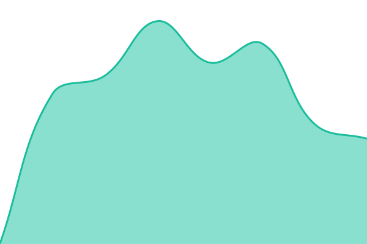

# [📈 Live Status](https://zinooo1789.github.io/status): <!--live status--> **모든 시스템 정상**

This repository contains the open-source uptime monitor and status page for [zinooo1789](https://zinooo1789.github.io/status), powered by [Upptime](https://github.com/upptime/upptime).

With [Upptime](https://upptime.js.org), you can get your own unlimited and free uptime monitor and status page, powered entirely by a GitHub repository. We use [Issues](https://github.com/zinooo1789/status/issues) as incident reports, [Actions](https://github.com/zinooo1789/status/actions) as uptime monitors, and [Pages](https://zinooo1789.github.io/status) for the status page.

<!--start: status pages-->
<!-- This summary is generated by Upptime (https://github.com/upptime/upptime) -->
<!-- Do not edit this manually, your changes will be overwritten -->
<!-- prettier-ignore -->
| URL | Status | History | Response Time | Uptime |
| --- | ------ | ------- | ------------- | ------ |
|  [홈페이지 (miristudio.pages.dev)](https://miristudio.pages.dev) | 정상 | [miristudio-pages-dev.yml](https://github.com/zinooo1789/status/commits/HEAD/history/miristudio-pages-dev.yml) | 

 226ms
     
 | 

<a href="https://zinooo1789.github.io/status/history/miristudio-pages-dev">100.00%</a>
    

|  [접수 워커 (miri-intake)](https://miri-intake.zinooo1789.workers.dev/api/health) | 정상 | [miri-intake.yml](https://github.com/zinooo1789/status/commits/HEAD/history/miri-intake.yml) | 

 154ms
     
 | 

<a href="https://zinooo1789.github.io/status/history/miri-intake">100.00%</a>
    

<!--end: status pages-->

[**Visit our status website →**](https://zinooo1789.github.io/status)

## 📄 License

- Powered by: [Upptime](https://github.com/upptime/upptime)
- Code: [MIT](./LICENSE) © [Anand Chowdhary](https://anandchowdhary.com)
- Data in the `./history` directory: [Open Database License](https://opendatacommons.org/licenses/odbl/1-0/)
